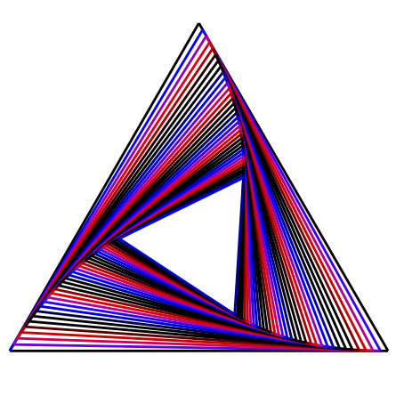
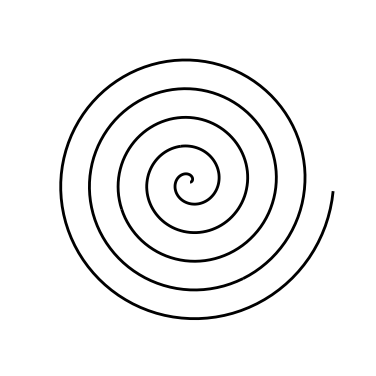
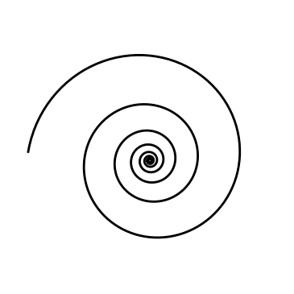
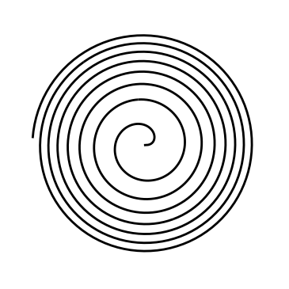

# psdraw

Written by [Eric R. Weeks](http://www.physics.emory.edu/faculty/weeks//):
> I decided to write a very simple program called "psdraw" which would take (X,Y) values and print them on a PostScript page. Then I could add the pictures to my web page ( [see Sec. 1 for information on converting PostScript to gif](http://www.physics.emory.edu/faculty/weeks//graphics/convert.html)). The program can produce graphs with axes and labels and such, or can produce simple drawings without axes.
>
> This program can print lines connecting the points, or just print a circle at each point. In addition, the color of each point can be specified by giving the program the data in (X,Y,R,G,B) form (red, green, blue colors). This program also has a crude way to plot 3D data (see below).
>
> Currently I've made a couple pictures with this program [(a simple picture to test the program](http://www.physics.emory.edu/faculty/weeks//ideas/trig.html) and one of my old favorites, [a fractal coral generator) ](http://www.physics.emory.edu/faculty/weeks//ideas/grass1.html). I add features to this program from time to time, mainly when I find something new I need to do, or occasionally by someone's request.

Original source:
http://www.physics.emory.edu/~weeks/graphics/psdraw.html

## How to compile

```shell
gcc dps.c -lm -o psdraw
```

## How to use
You can use psdraw in a pipe, or with a filename:

```shell
zcat datafile.Z | ./psdraw > output.ps
```

```shell
./psdraw datafile > output.ps
```

## Examples

### Spiral triangles


```shell
awk '\
BEGIN { ee = 0.08;
        x1=0;  y1=0;
        x2=10;  y2=0;
        x3=5;  y3=5*sqrt(3);
        print x1,y1,x2,y2,x3,y3,x1,y1;

        for (t=0;t<100;t++)  {
             x4 = ee*x2 + (1-ee)*x3;
             y4 = ee*y2 + (1-ee)*y3;
             print x4,y4;
             x3=x2;  y3=y2;
             x2=x1;  y2=y1;
             x1=x4;  y1=y4;
        }
      }
' | ./psdraw -l 0.1 -X - - - 10 > spi0.ps
```



```shell
awk '\
BEGIN { ee = 0.02;
        x1=0;  y1=0;
        x2=10;  y2=0;
        x3=5;  y3=5*sqrt(3);
        print x1,y1,0,0,0;             # black outline
        print x2,y2,0,0,0;
        print x3,y3,0,0,0;
        print x1,y1,0,0,0;

        for (t=0;t<100;t++)  {
             x4 = ee*x2 + (1-ee)*x3;
             y4 = ee*y2 + (1-ee)*y3;
             print x4,y4,sin(t/4),0,cos(t/4);
             x3=x2;  y3=y2;
             x2=x1;  y2=y1;
             x1=x4;  y1=y4
        }
      }
' | ./psdraw -l 0.1 -X - - - 10 -C > spi3.ps
```

From http://www.physics.emory.edu/faculty/weeks//ideas/spiral.html.

### More spirals



```shell
seq 0 0.002 1 | awk '{t=5*$1*2*3.14159;r=t;x=r*cos(t);y=r*sin(t);print x ,y}' | ./psdraw -S 10 10 -X -30 32 -30 32 -l 0.1 > sparch.ps
```



```shell
seq 0 0.002 1.5 | awk ' {a=1.0;b=0.1;t=5*$1*2*3.14159;r=a*exp(b*t);x=r*cos(t);y=r*sin(t);print x,y} ' | ./psdraw -X -111 96 -111 96 -S 10 10 -l 0.1 > splog.ps
```



```shell
seq 0 0.002 1.5 | awk ' {a=1.0;b=0.1;t=5*$1*2*3.14159;r=sqrt(t)*15;x=r*cos(t);y=r*sin(t);print x,y} ' | ./psdraw -X -111 96 -111 96 -S 10 10 -l 0.1 > spfermat.ps
```

From http://www.physics.emory.edu/faculty/weeks//ideas/spiral2.html.
